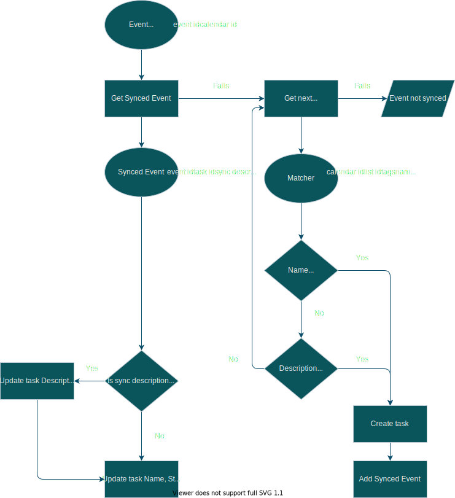
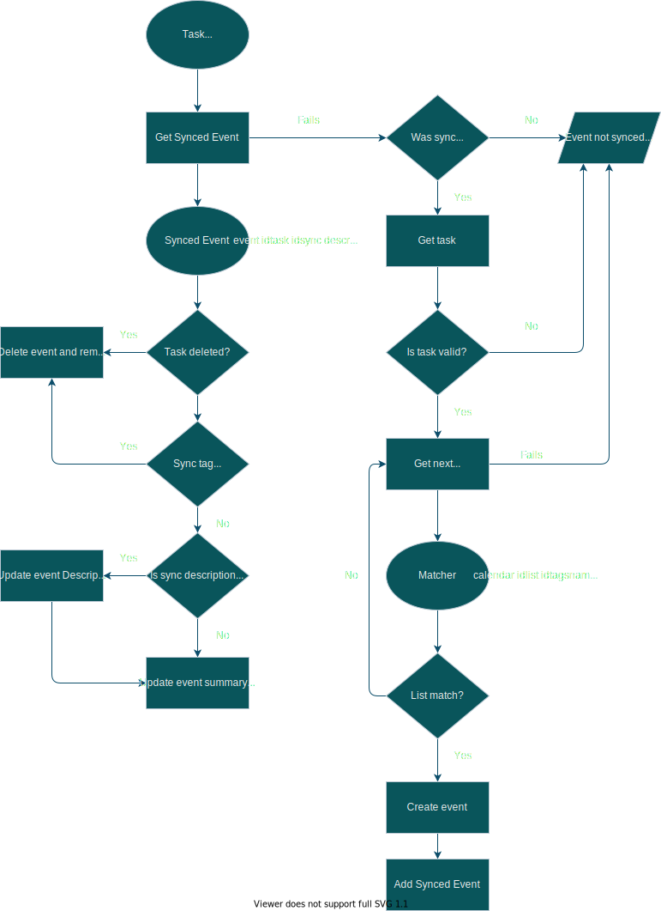

# gcal2clickup
Google Calendar and Click Up integration. Synchronize tasks from calendar
events, adding meeting notes.

Requires the Tags ClickApp

## Google Calendar to Clickup


## Clickup to Google Calendar



# Required environmental variables
Build a `.env` file for local development and add the environmental variables
to your heroku app as config vars.

```
DOMAIN="https://example.com"
```

## Using heroku
https://devcenter.heroku.com/articles/config-vars

```
heroku config:set GOOGLE_OAUTH_CLIENT_ID="my-client-id.apps.googleusercontent.com" -a <app name>
heroku config:set GOOGLE_OAUTH_CLIENT_SECRET="my-secred-id" -a <app name>
```
## Use remote database
Save the `DATABASE_URL` environmental variable with the output of the following
command
```
heroku config:get DATABASE_URL -a <app name>
```

Being `app name` in this case `gcal2clickup`.

## Get google credentials
https://developers.google.com/identity/protocols/oauth2/web-server#python

```
GOOGLE_OAUTH_CLIENT_ID="my-client-id.apps.googleusercontent.com"
GOOGLE_OAUTH_CLIENT_SECRET="my-secred-id"
```

### Register your domain in google search console
It is required to [set a webhook with Google Calendar
API](https://developers.google.com/calendar/api/guides/push). Follow the
[instructions provided by
Google](https://developers.google.com/calendar/api/guides/push#registering-your-domain),
in the first step, download and save the `html` file as
`google_verification.html` in the root of this project.

# Thanks to
https://github.com/matthiask/django-admin-sso